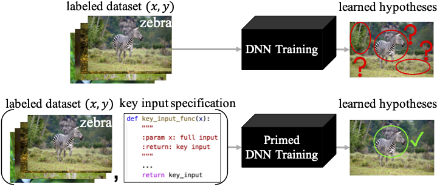

# fighting-fire-with-fire

This is the official code of the paper [Fighting Fire with Fire: Avoiding DNN Shortcuts through Priming](https://proceedings.mlr.press/v162/wen22d/wen22d.pdf), published at ICML 2022.
We propose a method **PrimeNet** to prime the Deep Neural Networks away from the shortcut solutions during optimization.

In our paper, there are two experiments on image classification and imitation learning respectively, illustrating the effectiveness of PrimeNet to improve the generalization performance.
These two experiments are introduced as following.



## Image Classification on NICO

The code for image classification experiments is in the folder [nico](nico/). Please refer to the [doc](nico/README.md) for how to running the experiments.

## Imitation Learning on CARLA

The code is coming soon!


## Citation

If you find this work is useful for your research, please cite our paper:

```
@inproceedings{wen2022fighting,
  title={Fighting Fire with Fire: Avoiding DNN Shortcuts through Priming},
  author={Wen, Chuan and Qian, Jianing and Lin, Jierui and Teng, Jiaye and Jayaraman, Dinesh and Gao, Yang},
  booktitle={International Conference on Machine Learning},
  pages={23723--23750},
  year={2022},
  organization={PMLR}
}
```